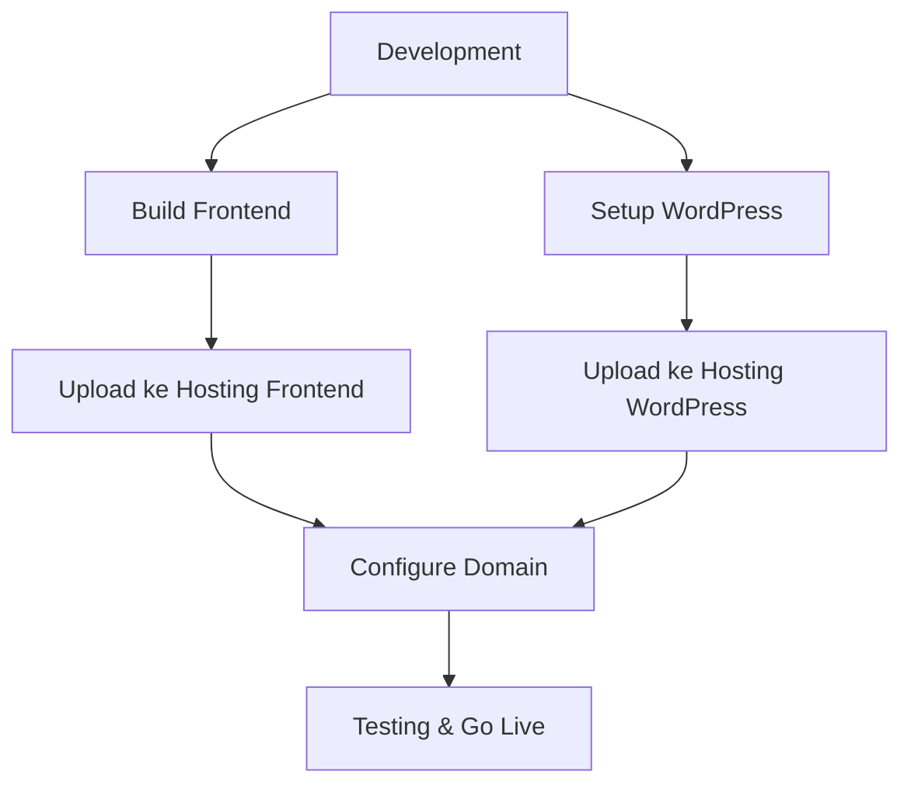

# Panduan Deployment Website Desa

Dokumen ini menjelaskan cara deploy Website Desa Tanjung Rambutan ke hosting production.

## 🎯 Overview Deployment



## 🌐 Pilihan Hosting

### Frontend Hosting (Gratis)
- **Netlify** ⭐ (Recommended)
- **Vercel**
- **GitHub Pages**
- **Firebase Hosting**

### WordPress Hosting
- **Shared Hosting** - Murah, cocok untuk start
- **VPS** - Lebih flexible, butuh technical knowledge
- **WordPress Managed Hosting** - Optimized untuk WordPress
- **Cloud Hosting** - Scalable, reliable

### Domain
- **.desa.id** - Domain khusus desa (gratis dari Kominfo)
- **.com/.id** - Domain komersial

## 🚀 Deployment Frontend

### 1. Persiapan Build
```bash
cd frontend

# Install dependencies
npm install

# Update environment untuk production
cp .env.example .env.production.local
```

**Edit .env.production.local:**
```env
REACT_APP_WP_API_URL=https://your-wordpress-domain.com/wp-json
REACT_APP_SITE_NAME=Desa Tanjung Rambutan
REACT_APP_DEBUG=false
```

### 2. Build Production
```bash
npm run build
```

Akan generate folder `dist/` berisi file production-ready.

### 3. Deploy ke Netlify

#### Via Netlify Drop (Cara Mudah)
1. Buka https://app.netlify.com/drop
2. Drag & drop folder `dist/`
3. Dapatkan URL temporary
4. Custom domain jika diperlukan

#### Via Git (Recommended)
1. Push code ke GitHub
2. Connect Netlify ke repository
3. Set build command: `npm run build`
4. Set publish directory: `dist`
5. Set environment variables di Netlify dashboard

#### Konfigurasi Netlify
Buat file `frontend/public/_redirects`:
```
/*    /index.html   200
```

### 4. Deploy ke Vercel
```bash
# Install Vercel CLI
npm install -g vercel

# Deploy
cd frontend
vercel --prod
```

## 🔧 Deployment WordPress

### 1. Persiapan Files
```bash
# Download WordPress terbaru
wget https://wordpress.org/latest.zip
unzip latest.zip

# Copy plugin custom
cp -r wordpress-backend/wp-content/plugins/desa-api-enhancements wordpress/wp-content/plugins/
```

### 2. Database Setup
```sql
-- Buat database baru
CREATE DATABASE desa_tanjungrambutan;
CREATE USER 'desa_user'@'localhost' IDENTIFIED BY 'secure_password';
GRANT ALL PRIVILEGES ON desa_tanjungrambutan.* TO 'desa_user'@'localhost';
FLUSH PRIVILEGES;
```

### 3. Konfigurasi wp-config.php
```php
<?php
// Database settings
define( 'DB_NAME', 'desa_tanjungrambutan' );
define( 'DB_USER', 'desa_user' );
define( 'DB_PASSWORD', 'secure_password' );
define( 'DB_HOST', 'localhost' );

// Security keys (generate dari https://api.wordpress.org/secret-key/1.1/salt/)
define( 'AUTH_KEY',         'unique-key-here' );
// ... tambahkan semua keys

// CORS untuk production
define( 'CORS_ALLOW_ORIGIN', 'https://your-frontend-domain.com' );
define( 'WP_REST_ALLOW_ANONYMOUS_COMMENTS', true );

// Security enhancements
define( 'WP_DEBUG', false );
define( 'DISALLOW_FILE_EDIT', true );
define( 'FORCE_SSL_ADMIN', true );
```

### 4. Upload ke Hosting

#### Via FTP/SFTP
```bash
# Compress WordPress files
tar -czf wordpress.tar.gz wordpress/

# Upload via FTP client (FileZilla, WinSCP, dll)
# Extract di hosting: tar -xzf wordpress.tar.gz
```

#### Via cPanel File Manager
1. Login cPanel
2. File Manager
3. Upload wordpress.tar.gz
4. Extract
5. Move files ke public_html/

### 5. WordPress Installation
1. Akses `https://your-domain.com/wp-admin/install.php`
2. Isi informasi site dan admin
3. Login dan aktivasi plugin "Desa API Enhancements"

## ⚙️ Konfigurasi Server

### Nginx Configuration
```nginx
server {
    listen 80;
    server_name your-domain.com;
    
    # Redirect to HTTPS
    return 301 https://$server_name$request_uri;
}

server {
    listen 443 ssl http2;
    server_name your-domain.com;
    
    # SSL Configuration
    ssl_certificate /path/to/certificate.crt;
    ssl_certificate_key /path/to/private.key;
    
    root /var/www/html;
    index index.php index.html;
    
    # WordPress permalink
    location / {
        try_files $uri $uri/ /index.php?$args;
    }
    
    # PHP processing
    location ~ \.php$ {
        fastcgi_pass unix:/var/run/php/php8.0-fpm.sock;
        fastcgi_param SCRIPT_FILENAME $document_root$fastcgi_script_name;
        include fastcgi_params;
    }
    
    # CORS headers untuk API
    location /wp-json/ {
        add_header Access-Control-Allow-Origin "https://your-frontend-domain.com";
        add_header Access-Control-Allow-Methods "GET, POST, OPTIONS";
        add_header Access-Control-Allow-Headers "Authorization, Content-Type";
        
        if ($request_method = OPTIONS) {
            return 204;
        }
        
        try_files $uri $uri/ /index.php?$args;
    }
}
```

### Apache .htaccess
```apache
# WordPress Permalinks
<IfModule mod_rewrite.c>
RewriteEngine On
RewriteBase /
RewriteRule ^index\.php$ - [L]
RewriteCond %{REQUEST_FILENAME} !-f
RewriteCond %{REQUEST_FILENAME} !-d
RewriteRule . /index.php [L]
</IfModule>

# CORS Headers
<IfModule mod_headers.c>
    Header always set Access-Control-Allow-Origin "https://your-frontend-domain.com"
    Header always set Access-Control-Allow-Methods "GET, POST, OPTIONS"
    Header always set Access-Control-Allow-Headers "Authorization, Content-Type"
</IfModule>

# Security Headers
<IfModule mod_headers.c>
    Header always set X-Content-Type-Options nosniff
    Header always set X-Frame-Options DENY
    Header always set X-XSS-Protection "1; mode=block"
</IfModule>

# Compression
<IfModule mod_deflate.c>
    AddOutputFilterByType DEFLATE text/plain
    AddOutputFilterByType DEFLATE text/html
    AddOutputFilterByType DEFLATE text/xml
    AddOutputFilterByType DEFLATE text/css
    AddOutputFilterByType DEFLATE application/xml
    AddOutputFilterByType DEFLATE application/xhtml+xml
    AddOutputFilterByType DEFLATE application/rss+xml
    AddOutputFilterByType DEFLATE application/javascript
    AddOutputFilterByType DEFLATE application/x-javascript
</IfModule>
```

## 🔒 Security Setup

### 1. SSL Certificate
```bash
# Via Let's Encrypt (gratis)
sudo certbot --nginx -d your-domain.com -d www.your-domain.com
```

### 2. WordPress Security
- Install plugin Wordfence atau Sucuri
- Enable two-factor authentication
- Regular backup dengan UpdraftPlus
- Update WordPress core dan plugins reguler
- Gunakan strong passwords

### 3. Database Security
```sql
-- Remove default users
DELETE FROM wp_users WHERE user_login = 'admin';

-- Update table prefix dari wp_ ke random
-- Edit wp-config.php: $table_prefix = 'xyz_';
```

## 🚨 Monitoring & Maintenance

### 1. Performance Monitoring
- Google PageSpeed Insights
- GTmetrix
- Pingdom

### 2. Uptime Monitoring
- UptimeRobot (gratis)
- Pingdom
- StatusCake

### 3. Error Tracking
- Sentry
- Rollbar
- WordPress debug.log

### 4. Analytics
- Google Analytics
- Google Search Console
- Cloudflare Analytics

## 📋 Post-Deployment Checklist

### Frontend
- [ ] Build berhasil tanpa error
- [ ] Routing berfungsi (refresh page works)
- [ ] API calls berhasil ke WordPress
- [ ] Responsive di semua device
- [ ] Performance score > 90 (PageSpeed)
- [ ] SSL certificate aktif
- [ ] Analytics tracking berfungsi

### WordPress
- [ ] WordPress installed & configured
- [ ] Plugin custom activated
- [ ] Custom post types tersedia
- [ ] REST API endpoints accessible
- [ ] CORS headers configured correctly
- [ ] Admin dashboard accessible
- [ ] File uploads working
- [ ] Permalink structure set
- [ ] Security plugins installed
- [ ] Backup scheduled

### Domain & DNS
- [ ] Domain pointing ke hosting
- [ ] WWW redirect configured  
- [ ] SSL certificate valid
- [ ] DNS propagation complete
- [ ] Email configured (optional)

## 🔧 Troubleshooting

### Common Issues

**1. CORS Errors**
```
Access blocked by CORS policy
```
**Solution:**
- Check wp-config.php CORS_ALLOW_ORIGIN
- Verify server CORS headers
- Test with browser developer tools

**2. API 404 Errors**
```
wp-json/desa/v1/info returns 404
```
**Solution:**
- Check plugin activation
- Flush permalinks (Settings → Permalinks → Save)
- Test direct API access in browser

**3. Build Errors**
```
Environment variables not found
```
**Solution:**
- Check .env files present
- Verify environment variable names
- Check hosting platform env vars

**4. Database Connection Error**
```
Error establishing database connection
```
**Solution:**
- Verify database credentials
- Check database server status
- Test connection manually

## 📞 Support & Resources

### Documentation
- [WordPress REST API Handbook](https://developer.wordpress.org/rest-api/)
- [React Deployment Guide](https://create-react-app.dev/docs/deployment/)
- [Netlify Docs](https://docs.netlify.com/)

### Communities
- WordPress Indonesia Facebook Group
- React Indonesia Telegram
- Stack Overflow

### Professional Services
Jika butuh bantuan deployment professional, kontak:
- Email: support@example.com
- WhatsApp: +62xxx-xxxx-xxxx

---

**Happy Deploying! 🚀**